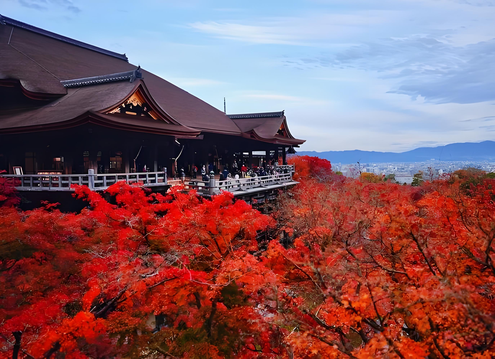
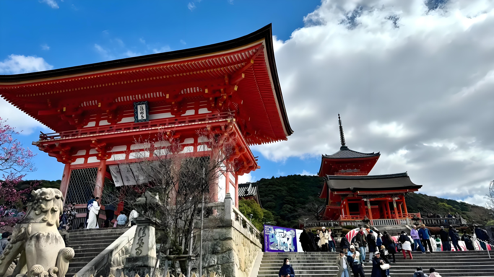
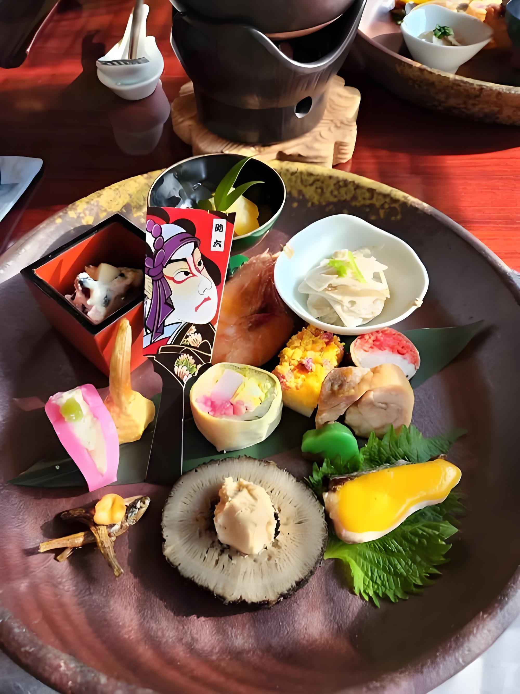
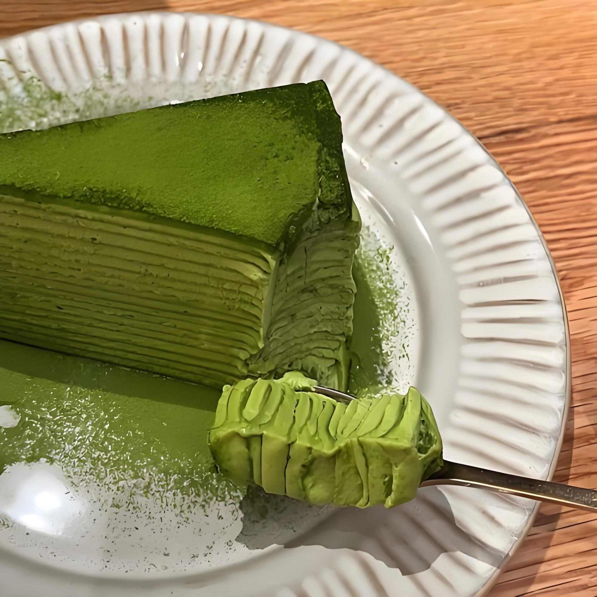

# 日本旅行日记：京都的秋天

## 初到京都

京都的秋天是最美的季节，红叶似火，古寺幽静，漫步在街头巷尾，仿佛穿越回了古代日本。

## 岚山竹林

岚山的竹林小径是京都最著名的景点之一，高耸的竹子在微风中摇曳，发出沙沙的声音。

> 走在竹林小径中，仿佛进入了一个神秘的世界，阳光透过竹叶洒下斑驳的光影。

## 清水寺

清水寺是京都最古老的寺院之一，站在清水舞台上，可以俯瞰整个京都市区。

## 美食推荐

- 京都豆腐料理

- 抹茶甜点

- 怀石料理

京都的美食文化同样令人印象深刻。