# 现代化图书馆后台管理系统

<h1 align="center">
  LibraryAdmin
</h1>

<p align="center">
  <strong>基于 Vue 3 + Element Plus 构建的现代化图书馆后台管理系统</strong>
</p>

<p align="center">
  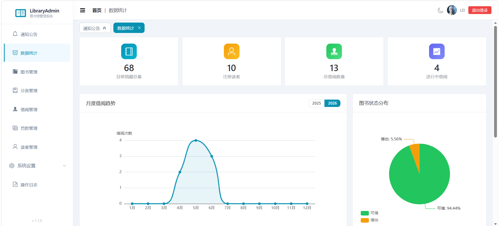
</p>

---

## 功能特性

### 核心模块

| 模块 | 说明 |
|------|------|
| **通知公告** | 发布和管理图书馆通知公告，支持优先级（紧急/重要/普通）、搜索与批量删除 |
| **数据统计** | 可视化仪表盘，包含关键指标卡片、饼图/折线图、热门图书与活跃读者排行 |
| **图书管理** | 完整增删改查、状态跟踪（可借/借出）、搜索与批量操作 |
| **分类管理** | 树形分类表，支持展开/收起、父子层级嵌套 |
| **借阅管理** | 图书借出与归还、日期校验、逾期高亮、分页列表 |
| **罚款管理** | 逾期罚款跟踪，含统计卡片、批量缴纳、缴费状态筛选 |
| **读者管理** | 完整增删改查、批量导入（CSV/JSON）、批量删除、借阅历史含统计 |
| **操作日志** | 完整审计追踪，支持操作类型筛选、日期范围搜索、关键词查找 |
| **系统设置** | 图书馆信息配置、借阅规则设定、管理员账号与角色管理 |

### 交互亮点

- **深色模式** — 浅色/深色主题一键切换，偏好自动持久化
- **标签页导航** — 多标签页动态打开/关闭，首页标签固定在最左侧
- **响应式布局** — 适配桌面端、平板、手机端，移动端侧边栏抽屉式展开
- **撤销操作** — 删除操作支持撤销恢复，UndoBar 浮层提示
- **骨架屏加载** — 表格加载时展示骨架屏占位
- **微交互** — 按钮按下缩放、弹窗缩放淡入、图标旋转动画、hover 过渡
- **无障碍** — 尊重 `prefers-reduced-motion` 系统偏好，减少动画

---

## 技术栈

| 技术 | 版本 | 说明 |
|------|------|------|
| Vue | 3.5+ | 渐进式 JavaScript 框架 |
| Vite | 8.0+ | 下一代前端构建工具 |
| Element Plus | 2.13+ | Vue 3 组件库 |
| Pinia | 3.0+ | Vue 状态管理库 |
| Vue Router | 5.0+ | Vue 路由管理器（Hash 模式） |
| ECharts | 6.0+ | 数据可视化图表库 |
| Less | 4.6+ | CSS 预处理器 |

---

## 项目结构

```plaintext
library-admin/
├── .github/workflows/           # GitHub Actions CI/CD（自动部署到 Pages）
├── .vscode/                     # VS Code 编辑器配置
├── public/                      # 静态资源
├── src/
│   ├── api/
│   │   └── mock.js              # Mock 数据接口与 localStorage 持久化
│   ├── assets/                  # 静态资源文件
│   ├── components/
│   │   ├── PaginationBox.vue    # 可复用分页组件
│   │   ├── StatCard.vue         # 统计卡片组件
│   │   ├── TableSkeleton.vue    # 表格加载骨架屏
│   │   └── UndoBar.vue          # 撤销操作提示条
│   ├── router/
│   │   └── index.js             # 路由定义与鉴权守卫
│   ├── stores/
│   │   ├── user.js              # 用户登录状态管理
│   │   └── theme.js             # 深色/浅色主题状态
│   ├── views/
│   │   ├── Login.vue            # 登录页面（渐变背景）
│   │   ├── 404.vue              # 404 未找到页面
│   │   ├── Layout.vue           # 主布局（顶栏、侧边栏、标签页）
│   │   ├── AnnouncementList.vue # 通知公告管理
│   │   ├── Dashboard.vue        # 数据统计首页
│   │   ├── BookList.vue         # 图书管理
│   │   ├── CategoryList.vue     # 分类树管理
│   │   ├── BorrowList.vue       # 借阅管理
│   │   ├── FineManagement.vue   # 罚款管理
│   │   ├── ReaderList.vue       # 读者管理
│   │   ├── ReaderBorrowHistory.vue  # 读者借阅历史
│   │   ├── OperationLog.vue     # 操作日志
│   │   ├── BasicSettings.vue    # 系统基本设置
│   │   └── AdminManagement.vue  # 管理员账号管理
│   ├── App.vue                  # 根组件（主题切换 + 页面过渡动画）
│   ├── main.js                  # 应用入口
│   └── style.css                # 全局样式与 CSS 变量
├── index.html                   # HTML 模板
├── package.json                 # 依赖配置
├── vite.config.js               # Vite 配置
└── README.md                    # 项目说明文档
```

---

## 快速开始

### 环境要求

- [Node.js](https://nodejs.org/) >= 18

### 安装依赖

```bash
npm install
```

### 开发模式运行

```bash
npm run dev
# → http://localhost:3000
```

### 构建生产版本

```bash
npm run build
```

### 预览生产版本

```bash
npm run preview
```

---

## 登录信息

| 字段 | 值 |
|------|-----|
| 用户名 | 任意用户名 |
| 密码 | `123456` |

> **提示：** 系统使用 Mock 数据并存储在 localStorage 中，登录验证仅检查密码是否为 `123456`。

---

## 界面截图

### 登录页面

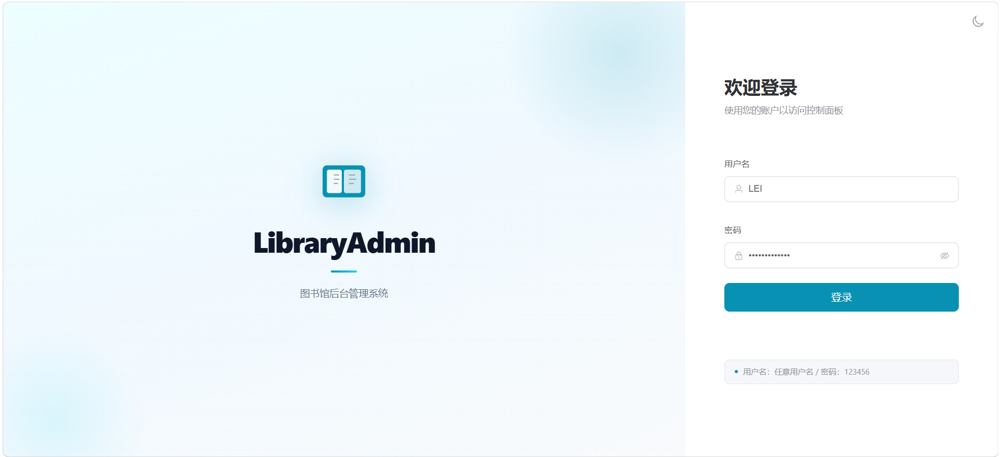

*渐变背景、居中登录卡片，支持表单验证与加载状态*

### 通知公告（首页）

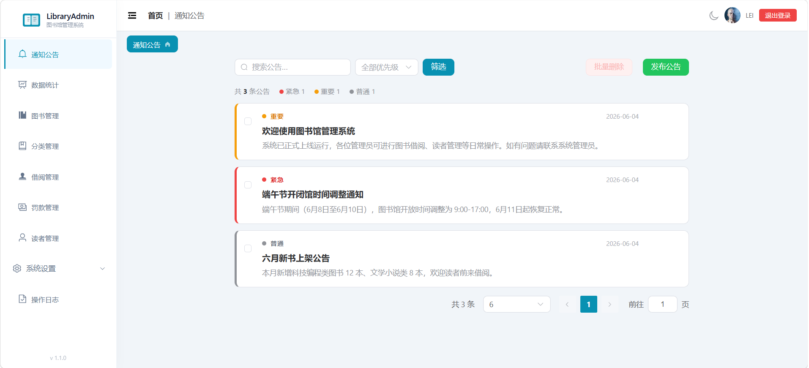

*优先级筛选、统计条、卡片式/表格式布局、批量删除支持撤销*

### 数据统计仪表盘


*统计卡片（馆藏总量、借出数量）、图书状态饼图、月度借阅趋势折线图、热门图书 TOP5、活跃读者 TOP5*

### 图书管理

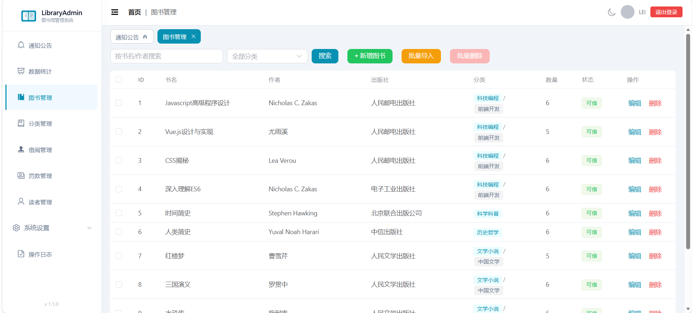

*搜索与分页、对话框表单增删改、父子分类标签展示*

### 分类管理

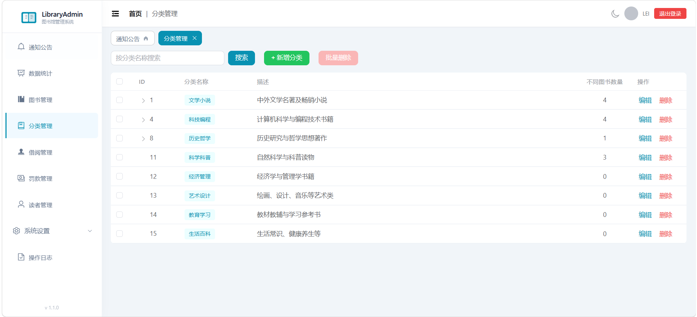

*树形表格支持展开收起、父子分类扁平搜索、批量删除*

### 借阅管理

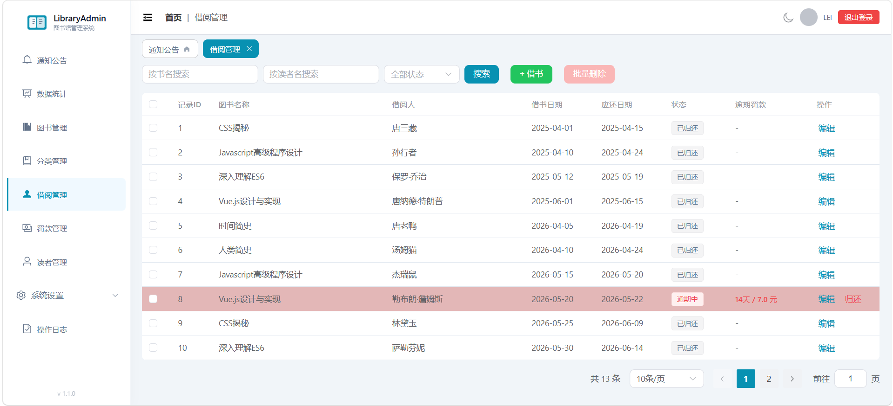

*借出与归还流程、日期校验、逾期记录红色高亮*

### 罚款管理

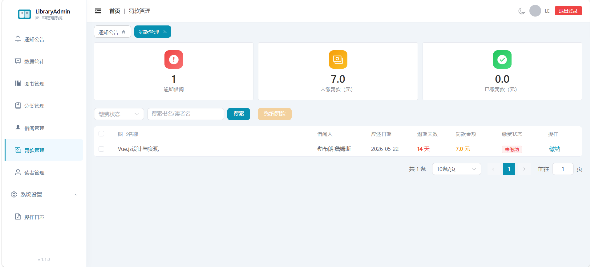

*统计卡片（逾期数量、未缴/已缴金额）、批量缴纳、缴费状态筛选*

### 读者管理

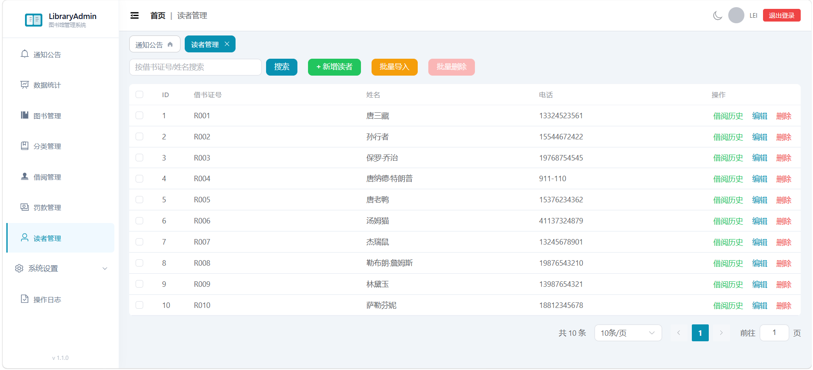

*CSV/JSON 批量导入、借阅历史下钻（含统计卡片）*

### 操作日志

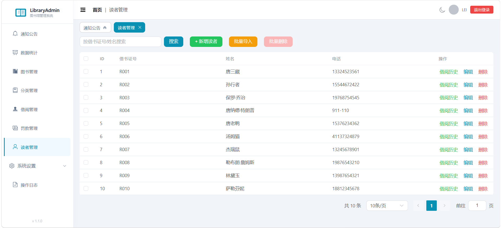

*按操作类型与日期范围筛选、分页审计追踪*

### 系统设置

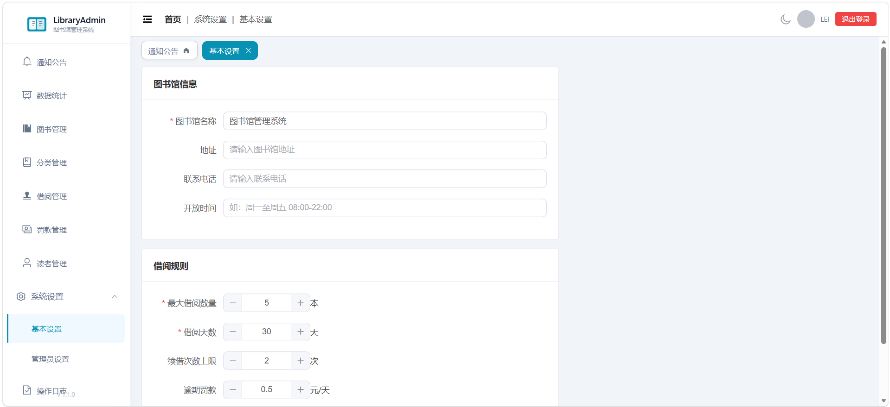

*图书馆信息表单、借阅规则配置、管理员角色管理*

### 深色模式

<p>
  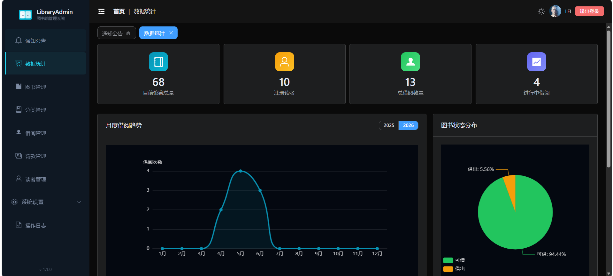
  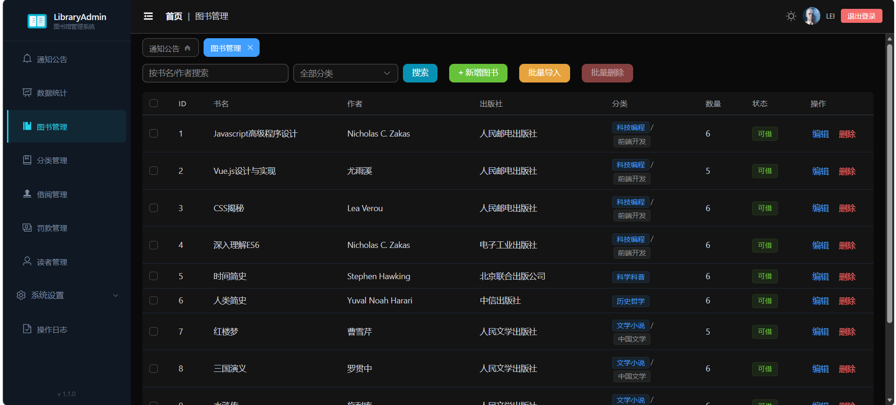
</p>

*主题一键切换，偏好自动保存至 localStorage*

### 移动端适配

<p>
  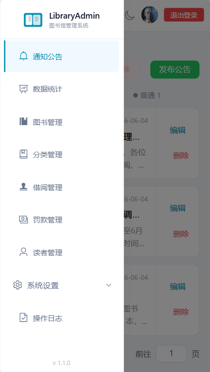
  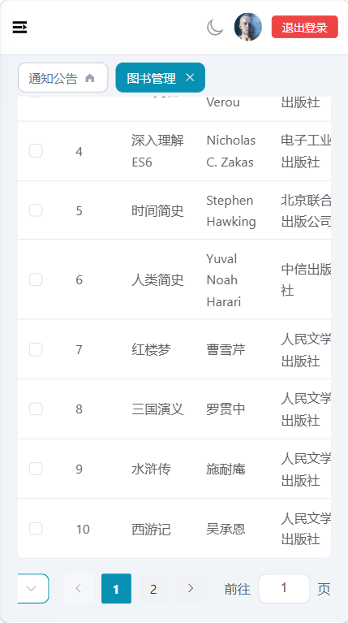
</p>

*移动端抽屉式侧边栏，表格横向滚动适配*

---

## 功能清单

- [x] 用户登录/登出（含路由守卫）
- [x] 渐变背景登录页面（含表单验证）
- [x] 通知公告管理（增删改查、优先级、批量操作）
- [x] 图书 CRUD 操作（含父子分类标签）
- [x] 分类树形管理（展开收起、扁平搜索）
- [x] 借阅管理（借出/归还/日期校验）
- [x] 借阅逾期高亮显示
- [x] 罚款管理（统计卡片、批量缴纳）
- [x] 读者 CRUD 操作
- [x] 读者批量删除与批量导入（CSV/JSON）
- [x] 读者借阅历史页面（含统计卡片）
- [x] 操作日志（类型筛选、日期范围搜索）
- [x] 系统设置（图书馆信息、借阅规则）
- [x] 管理员管理（角色系统：超级/普通管理员）
- [x] 数据统计仪表盘（ECharts 可视化）
- [x] 表格分页（可复用 PaginationBox 组件）
- [x] 深色模式切换（localStorage 持久化）
- [x] 动态多标签页导航（首页标签固定）
- [x] 软删除 + UndoBar 撤销提示
- [x] 表格加载骨架屏
- [x] 响应式布局（桌面端 / 平板 / 手机端）
- [x] 自定义主题色（青色主色调）
- [x] 侧边栏版本号显示
- [x] 404 未找到页面
- [x] 页面切换过渡动画（淡入淡出）
- [x] 微交互（按钮缩放、图标旋转、弹窗动画）
- [x] 减少动画偏好无障碍支持
- [x] GitHub Actions 自动部署到 GitHub Pages
- [x] localStorage Mock 数据持久化

---

## 部署

项目已配置 **GitHub Pages** 自动部署，通过 GitHub Actions 实现。

### 配置说明

`vite.config.js` 中需配置正确的 base 路径：

```js
export default defineConfig({
  base: '/library-admin/',  // 修改为你的仓库名称
  // ...
})
```

`.github/workflows/deploy.yml` — 推送 `main` 分支时自动触发，使用 Vite 构建后部署至 GitHub Pages。

### 手动部署

```bash
npm run build
# 将 dist/ 目录上传至任意静态网站托管服务即可
```