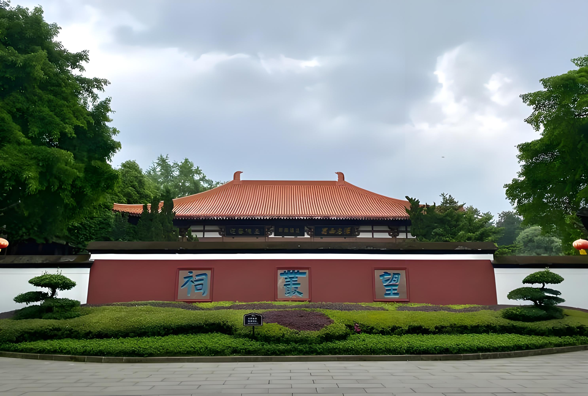
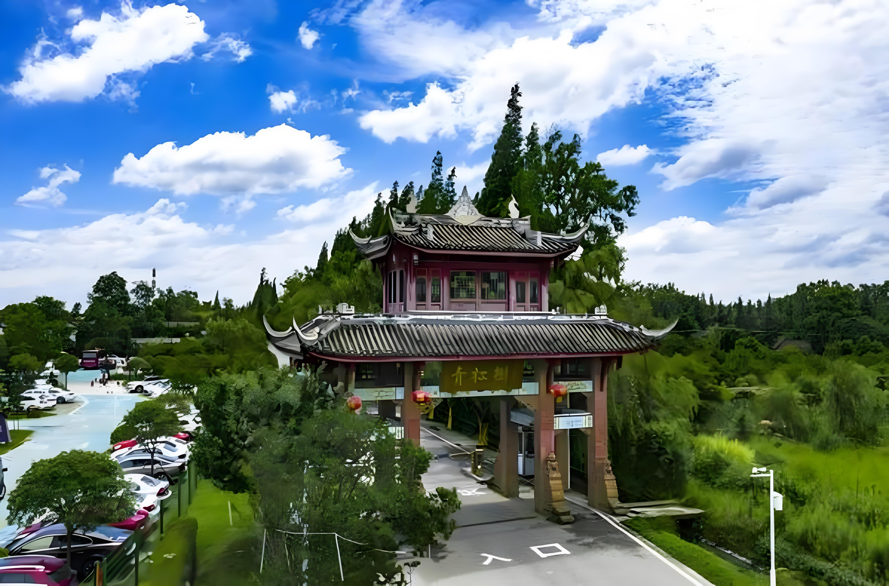

# 郫都区好玩的地方推荐

---

## 1. 望丛祠

- **二帝陵冢‌**：祠内有望帝陵和丛帝陵两座大型陵墓，其中望帝陵是西南地区最大的帝王陵墓，周围古柏森森，氛围庄严肃穆。

- **园林水景‌**：园内有大片水域鳖灵湖，6 月正值荷花初盛，红墙黛瓦搭配荷塘光影，非常适合古风拍照和休闲散步。

- **文化体验‌**：这里每年农历 `五月十五`（大端阳）会举办望丛赛歌会，是汉民族唯一保留下来的赛歌形式，现场还能体验蜀绣、陶艺等非遗手作。

- **生态观鸟‌**：古柏林中栖息着大量白鹭、夜鹭等鸟类，被称为成都的“鹭鸟王国”，清晨或傍晚容易观察到鸟儿活动。‌

### 开放时间

目前处于夏季开放时间，每天‌ `08:00-18:00‌` 开放，`17:00` 左右停止入园，建议预留 `2-3` 小时游玩。

### 最佳时节

除了 6 月赏荷，每年农历`五月十五`的赛歌会期间最为热闹，喜欢民俗活动的朋友可届时前往。‌

---

## 2. 成都科幻馆/世界科幻公园

### 科幻馆

- **看建筑拍大片‌**：整个馆长得像“星云”，屋顶有个 1382 平米的“科幻之眼”，灵感来自三星堆面具，白天晚上拍照都很出片。

- **玩沉浸式互动‌**：馆内有 9 米高的机械狗“笨笨”，晚上会变激光秀；还有时空隧道、三体有声画廊，能体验 VR 飞行和机甲对战。

- **逛主题特展‌**：近期有“火星登陆计划”科普展，能模拟在火星生活。‌

### 科幻馆开放时间

每天‌ `10:00-18:00‌` 开发，‌`17:00` 就停止入场‌了，‌每周一闭馆‌（法定节假日除外，比如 6 月 1 日正常开，6 月 2 日可能调休闭馆）。

### 科幻公园

- **户外休闲漫步‌**：公园内有曙光沙滩、环湖绿道、蜀韵园林区，傍晚可观看光影水秀（通常周六晚 `20:30` 左右），适合露营和散步。

### 科幻公园开放时间

科幻公园户外区域全天开放

---

## 3. 三道堰镇

- **惠里特色街区‌**：依河而建的古风街区，集合了美食、休闲和民俗表演，晚上灯火阑珊时更有韵味，是体验水乡夜生活的好地方。

- **青杠树景区‌**：国家 4A 级景区之一，生态环境好，适合休闲观光和亲子研学。

- **永定桥与堰桥‌**：永定桥历史悠久，最早建于清代，见证了三道堰的水陆码头繁华；堰桥上有很多楹联和照片，反映当地风土人情。

- **水乡文化广场‌**：这里有吐水的龙舟雕塑和喷泉，还能看到古老的马槎、笼篼等治水工具展示。

- **导堰公园‌**：以“三道堰”得名由来的导水堰为主题的公园，适合散步。‌

- **成都川菜博物馆‌**：位于三道堰镇内，是可以吃的博物馆，能了解川菜文化还能亲手体验制作，适合带小朋友去研学。‌‌

### 什么时候去最好

- **端午节龙舟会‌**：每年农历端午节，镇上都会举办盛大的龙舟会，有赛龙舟、抢鸭子、放河灯、歌舞表演等活动，非常热闹，已经举办了 50 多届。

- **平时休闲‌**：镇上无工业污染，柏条河和徐堰河水质清澈，平时去喝茶、品美食、看水景也很惬意，适合周末短途游。‌

